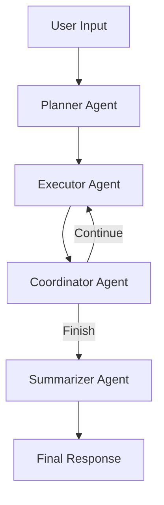

# MEMU - Multi-Agent Workflow System

## Overview

MEMU (Multi-Agent Enhanced Memory Unit) is an advanced AI agent system built with xAI, LangChain-JS, and LangGraph-JS that transforms workflow nodes into intelligent tools for complex, multi-agent task execution.

## Architecture

### Core Components

1. **Enhanced xAI Agent (`src/lib/xai_agent.ts`)**
   - `workflow_xai_agent` class with LangGraph integration
   - Multi-agent workflow orchestration
   - Dynamic tool registration from workflow nodes
   - Token usage and cost tracking

2. **Multi-Agent Workflow**
   - **Planner Agent**: Analyzes user requests and creates execution plans
   - **Executor Agent**: Executes individual steps using registered tools
   - **Coordinator Agent**: Manages workflow continuation and error recovery
   - **Summarizer Agent**: Creates comprehensive final responses

3. **API Endpoints (`src/app/api/memu/`)**
   - `/api/memu` - Main chat interface with multi-agent support
   - `/api/memu/workflows` - Workflow management (CRUD operations)
   - `/api/memu/templates` - Pre-built workflow templates

### Key Features

#### Node-to-Tool Conversion
Workflow nodes are automatically converted into LangChain tools:

```typescript
// Example: Image Generator Node becomes a tool
{
  name: "generate_image_node_123",
  description: "Generate an image using flux/schnell model",
  parameters: z.object({
    prompt: z.string().describe("The prompt for image generation"),
    style: z.string().optional().describe("Style parameters"),
    size: z.string().optional().describe("Image size"),
  }),
  execute: async (input) => await this.execute_image_generation_node(node, input)
}
```

#### Supported Node Types
- **LLM Nodes**: Text processing and generation
- **Image Generator Nodes**: AI image creation with multiple models
- **Text Analyzer Nodes**: Content analysis and insights
- **Conditional Nodes**: Logic branching (planned)
- **Loop Nodes**: Iteration support (planned)

#### Multi-Agent Coordination


## Pre-built Templates

### 1. Content Creator Assistant
- **Purpose**: Generate and refine content with visuals
- **Nodes**: Content generation → Text analysis → Image creation
- **Use Cases**: Blog posts, social media content, marketing materials

### 2. Research & Analysis Assistant
- **Purpose**: Comprehensive research workflows
- **Nodes**: Research planning → Information synthesis → Quality analysis
- **Use Cases**: Academic research, market analysis, competitive intelligence

### 3. Creative Brainstorming Hub
- **Purpose**: Multi-perspective ideation
- **Nodes**: Divergent thinking → Practical solutions → Concept synthesis → Visualization
- **Use Cases**: Product development, creative campaigns, innovation workshops

### 4. Document Analysis & Summary
- **Purpose**: Document processing and insights
- **Nodes**: Structure analysis → Content summarization → Insight extraction
- **Use Cases**: Report analysis, legal document review, content auditing

### 5. Social Media Content Manager
- **Purpose**: Multi-platform content optimization
- **Nodes**: Platform-specific creation → Visual generation → Engagement optimization → Hashtag generation
- **Use Cases**: Social media campaigns, brand management, influencer content

## Usage Examples

### Basic Chat with Workflow
```typescript
// Chat with a specific workflow
const response = await fetch('/api/memu', {
  method: 'POST',
  headers: { 'Content-Type': 'application/json' },
  body: JSON.stringify({
    session_id: 'session_123',
    workflow_id: 'workflow_456',
    message: 'Create a marketing campaign for eco-friendly products'
  })
});
```

### Creating Workflow from Template
```typescript
// Create workflow from template
const workflow = await fetch('/api/memu/templates', {
  method: 'POST',
  headers: { 'Content-Type': 'application/json' },
  body: JSON.stringify({
    template_id: 'content_creator',
    workflow_name: 'My Content Workflow',
    workflow_description: 'Custom content creation pipeline'
  })
});
```

### Managing Workflows
```typescript
// Get all user workflows
const workflows = await fetch('/api/memu/workflows');

// Update workflow
await fetch('/api/memu/workflows', {
  method: 'PUT',
  body: JSON.stringify({
    id: 'workflow_123',
    name: 'Updated Workflow',
    nodes: [...updatedNodes],
    settings: { auto_execute: true }
  })
});

// Delete workflow
await fetch('/api/memu/workflows?id=workflow_123', {
  method: 'DELETE'
});
```

## Agent State Management

```typescript
interface agent_state {
  messages: BaseMessage[];           // Conversation history
  workflow_id?: string;             // Associated workflow
  session_id: string;               // Session identifier
  user_id: string;                  // User identifier
  variables: Record<string, any>;   // Execution variables
  current_step: string;             // Current execution step
  execution_history: any[];         // Step execution history
  available_tools: workflow_node_tool[]; // Registered tools
  token_usage: { input: number; output: number }; // Token tracking
  model_costs: number;              // Model usage costs
}
```

## Cost Management

The system tracks and manages costs across multiple dimensions:

- **Text Generation**: 1 MP per 3000 tokens (minimum 1 MP)
- **Image Generation**: Variable costs by model (3-12 MP)
- **Text Analysis**: 0.5 MP per analysis
- **Workflow Execution**: Combined costs of all nodes

## Error Handling & Recovery

- **Rate Limiting**: Configurable limits based on user plan
- **Token Validation**: Pre-execution token balance checks
- **Graceful Degradation**: Continued execution despite individual node failures
- **Error Recovery**: Coordinator agent attempts to recover from failures

## Database Schema

### Workflows Table
- `id`, `user_id`, `template_id`
- `name`, `description`, `graph_data`
- `settings`, `is_active`, `created_at`, `updated_at`

### Workflow Nodes Table
- `id`, `workflow_id`, `node_id`
- `type`, `position`, `data`, `connections`
- `created_at`, `updated_at`

### Workflow Sessions Table
- `id`, `user_id`, `workflow_id`
- `name`, `created_at`, `updated_at`

### Workflow Messages Table
- `id`, `session_id`, `role`, `content`
- `metadata`, `created_at`

## Integration with Existing Systems

### Authentication
- Uses Clerk for user authentication
- Integrates with existing user and subscription systems

### Token Management  
- Leverages existing MP token system
- Supports both renewable and permanent tokens
- Uses `deduct_tokens_v2` RPC function

### Rate Limiting
- Integrates with Upstash Redis for rate limiting
- Configurable limits based on subscription tier

## Migration from Old System

The new MEMU system is designed to coexist with the existing workflow-chatbot system:

1. **API Endpoints**: New `/api/memu/*` endpoints alongside existing ones
2. **Database Compatibility**: Uses same database schema with enhanced features
3. **Gradual Migration**: Can migrate workflows and sessions incrementally
4. **Backward Compatibility**: Existing workflows continue to function

## Performance Optimizations

- **Parallel Tool Execution**: Where possible, tools are executed in parallel
- **Conversation Memory**: Maintains conversation context with message history limits
- **Token Optimization**: Efficient token usage tracking and cost calculation
- **Caching**: Template and workflow data caching for improved response times

## Security Features

- **User Isolation**: RLS policies ensure users only access their data
- **Input Validation**: Comprehensive input validation and sanitization
- **Token Security**: Secure token deduction with rollback capabilities
- **Rate Limiting**: Protection against abuse and API overload

## Future Enhancements

1. **Advanced Node Types**: Conditional logic, loops, API integrations
2. **Visual Workflow Editor**: Drag-and-drop workflow creation interface
3. **Workflow Sharing**: Public template marketplace
4. **Real-time Collaboration**: Multi-user workflow editing
5. **Advanced Analytics**: Workflow performance and usage analytics
6. **Custom Tool Registry**: User-defined custom tools and integrations

## Development Notes

- Built with TypeScript for type safety
- Uses functional programming and DRY principles
- Follows snake_case naming convention
- Comprehensive error handling and logging
- Extensive documentation and code comments

## Testing

The system includes comprehensive testing across:
- Unit tests for individual agents and tools
- Integration tests for workflow execution
- End-to-end tests for complete user workflows
- Performance tests for scalability validation

---

**Note**: This system represents a significant evolution in AI-powered workflow automation, combining the flexibility of visual workflow design with the intelligence of multi-agent AI systems. 